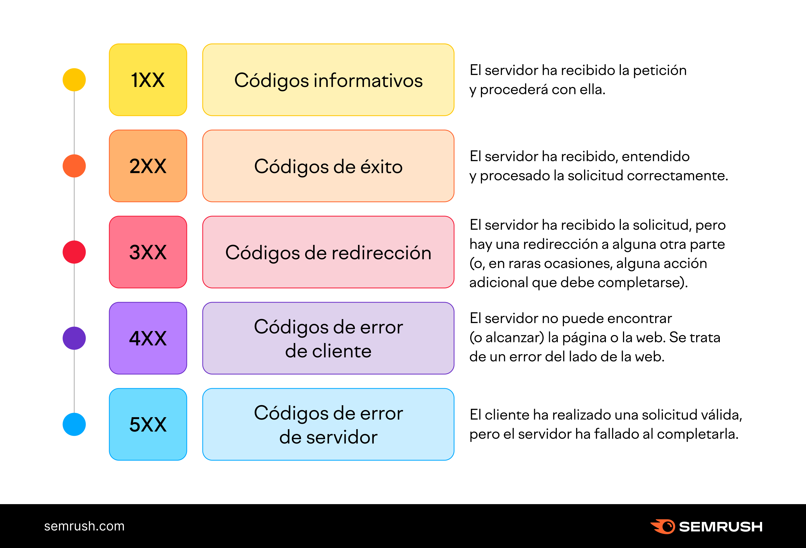

# PROTOCOLO HTTP

## Definición
El protocolo HTTP (Hypertext Transfer Protocol) es la base de la comunicación en la World Wide Web, este protocolo permite que los servidores, paginas web y otros dispositivos se comuniquen de manera eficiente haciendo más facil el intercambio de información de manera estrucurada.

## Versiones de Http
* *HTTP/0.9:* Fué la primera versión de Http, esta era muy básica y no tenia soporte.
* *HTTP/1.0:* Introdujo el uso explícito del número de versión en las comunicaciones y permitió los métodos GET, HEAD y POST.
* *HTTP/1.1:* Permitió envíar mpultiples solicitudes.
* *HTTP/2:* Implementó el soporte para server push.
* *HTTP/3:* Usa UDP mediante QUIC (Quick UDP Internet Connections), lo cual mejora significativamente la velocidad comparándolo con TCP usado por sus predecesores.

## Ciclo de la solicitud de respuesta HTTP
1. Ciente realiza solicitud al servidor.
2. La solicitud incluye una linea con el método HTTP y la URL solicitada.
3. Se procesa la solicitud según sea necesario.
4. Después de que se procesa la solicitus, el servidor envía la respuesta.

## Estructura
Se basa en cuatro partes
1. **Linea de solicitud (Request line):** Se usan para saber que es lo que se quiere mandar
2. **Encabezados (Headers):** Contiene la información de donde se quiere mandar la solicitud.
3. **Cuerpo (Body):** Contiene los datos enviados al servidor.
4. **Separador de Linea (Black Line):** Indica el fin de los encabezados.

## Métodos
* **Get:** Obtiene los datos del servidor
* **Post:** Orea recursos en el servidor (envia datos)
* **Put:** Se usa para actualizar
* **Delete:** Elimina un recurso especifico
* **Patch:** Modifica un recurso especifico
* **HEAD:** Obtiene metadatos
* **OPTIONS:** Describe opciones de comunicacion
* **CONNECT:** Establece conexion
* **TRADE:** Muestra el camino que siguie la solicitud

## Códigos de estado
Indican si se ha completado de manera satisfactoria la solicitud Http que se haga al visitar un navegador web

Se dividen en 5 categorias:

El primer número indica la categoría y el segundo indica la informacion especifica. 

## Encabezados HTML
Clasificados según su contexto y comportamiento de proxies

### Según su contexto
* Generales.
* De consulta.
* De respuesta.
* De entidad.

### Según su comportamiento en proxies
* Extremo a Extremo.
* De paso.